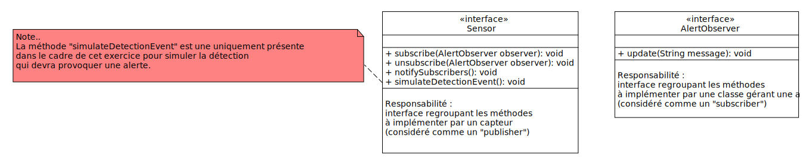

# Design pattern "oberser"

## Principe

Le design pattern "oberserver" est un patron de conception comportemental permettant de mettre en place un mécanisme de notification de changement d'un **objet à plusieurs autre**.

Pour plus d'informations sur ce design pattern consulter les paragraphes "Intention", "Problème", "Solution", "Analogie" et "Structure" de la page disponible [ici](https://refactoring.guru/fr/design-patterns/facade).

Un exemple d'implémentation concret est disponible [ici](https://www.baeldung.com/java-observer-pattern#observer-pattern).

> [!WARNING]
> L'article sur le site [baeldung.com](https://www.baeldung.com/java-observer-pattern#observer-pattern) propose plusieurs solutions d'implémentation : dans cette exercice de découverte c'est celle détaillée par le paragraphe "What is the Observer pattern ?" qui nous intéresse.
> Il existe également une solution basée sur l'utilisation de classes fournies par le JDK (par exemple en utilisant la classe [PropertyChangeListener](https://www.baeldung.com/java-observer-pattern#PropertyChangeListener)).

## Exercice d'application

Vous allez implémenter un design pattern observer pour simuler un système domotique d'alerte des accidents ménagers.

L'objectif est de simuler l'activité de **capteurs divers** et mettre en place ce système.

Les capteurs peuvent être, par exemple :
- capteur de fumée (`SmokeSensor`) ;
- capteur de température (`TemperatureSensor`) ;
- capteur de dioxyde d'azote (`NO2Sensor`).

Lorsque les évènements seront détectés par les capteurs, les alertes pourront être :
- envoi d'email automatisé (par exemple `EmailAlert`) ;
- notification sur une application smartphone ;
- appel direct des secours ;
- déclenchement d'une alarme.

Chaque capteur sont considérés comme des **"publishers"** et les différents systèmes d'alertes seront des **"observers"**.

Ci-dessous des propositions d'interface permettant de regrouper les méthodes définissant les comportements des "publishers" et "observers". 



Le fichier "uxf" est disponible dans ce dépôt, à vous de le compléter avant de mener à bien vos développements.

Dans votre méthode `main` vous pourrez implémenter le pseudo-code suivant :
```java
public static void main(String[] args) {
    // instanciation d'un ou plusieurs capteurs (publishers)
    
    // instanciation d'un ou plusieurs systèmes d'alertes (subscribers)

    // ajout des systèmes d'alertes aux capteurs

    // simulation de la détection d'anomalies

}
```

## Travail à faire

1. Etablir le diagramme de classe UML permettant de représenter le système complet
2. Implémentez les classes correspondant à vos "publishers" et "subscribers"
3. Tester votre classe via des appels à partir de la fonction `main`